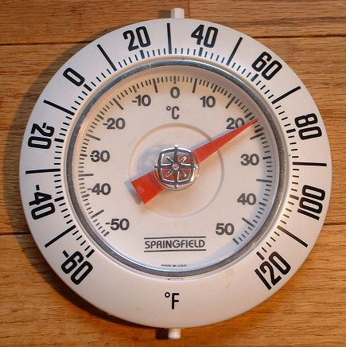

# Celcius

## Menyalakan Panas

Di masa lalu, jika Anda ingin tahu suhu di luar ruangan, Anda harus melihat salah satu yang seperti ini, yang mungkin dipasang di luar di rumah Anda.



Sebelumnya, jika Anda ingin tahu suhu di luar, Anda harus berdiri di luar. Sekarang, cukup  membuka aplikasi cuaca di ponsel Anda atau mengunjungi situs web pelaporan cuaca untuk mendapatkan suhu saat ini dan ramalan lima hari kedepan. Tidak perlu dipusingkan dengan lingkarang angka di atas atau saudaranya, tabung merkuri.

Bergantung pada tempat Anda tinggal di dunia, negara Anda menggunakan salah satu dari dua skala suhu utama. Di hampir setiap negara di dunia, termasuk Indonesia, Anda mungkin paling akrab dengan skala Celcius, dan jika Anda mendengar bahwa suhu di luar 30&deg; Anda mungkin akan mencari-cari pakaian renang di lemari pakaian Anda dan mengenakan tabir surya, karena ini adalah hari pantai yang indah. Pada skala Celcius, 0&deg; adalah titik beku air, dan 100&deg; adalah titik didih.

Jika Anda tinggal di Amerika Serikat (dan tidak menghabiskan sebagian besar hari Anda bekerja di laboratorium sains), kemungkinan Anda terbiasa dengan skala Fahrenheit. Dalam hal ini, jika Anda mendengar bahwa suhu di luar 30&deg; Anda mungkin mengenakan mantel tebal dan celana hangat dan memepersiapkan diri untuk kemungkinan turunnya salju, karena suhu tersebut berarti cukup dingin, mengingat titik beku air adalah 32&deg;. Di sisi lain, air tidak akan mendidih sebelum mencapai 212&deg;.

Kami mengakui bahwa dengan sebagian besar aplikasi yang memberi tahu Anda cuaca, cukup mudah untuk menekan tombol pilihan yang mengubah tampilan suhu dari Celsius ke Fahrenheit (atau sebaliknya), tetapi sebelum proses itu diotomatiskan untuk kita, orang harus menghafal sebagian titik konversi yang lebih umum atau harus menggunakan rumus matematika untuk mengkonversi dari satu skala ke skala lain, yang akan sangat dibutuhkan jika Anda berencana bepergian ke Amerika.

Untuk masalah ini, kita akan fokus pada konversi hanya dalam satu arah: _dari_ Fahrenheit _ke_ Celcius. Rumus untuk konversi ini tidak terlalu rumit. (Fiuh!) Seseorang cukup mengambil suhu saat ini dalam derajat Fahrenheit (&deg;F), menguranginya dengan 32, mengalikannya dengan 5, dan kemudian membaginya dengan 9. Hasilnya adalah suhu setara dalam derajat Celcius (&deg;C). Tidak sulit kan? Untuk yang lebih senang visual, cara tersebut dapat diterjemahkan ke dalam rumus ini:

```
C = (F - 32) * 5 / 9
```

Perlu diketaui, orang Amerika Serikat, dan juga komputer, menyatakan tanda desimal dengan simbol titik. Maka untuk sementara kita akan menggunakan tanda titik sebagai pembatas desimal.

Mari kita lakukan tes singkat untuk memastikan semuanya berjalan seperti yang diharapkan. Orang-orang di Amerika Serikat tahu suhu tubuh manusia normal adalah 98.6&deg;F (perhatikan tanda titik yang digunakan sebagai pembatas desimal). Jika kita memasukkan "98.6" ke dalam rumus menggantikan &deg;F dan melakukan perhitungan (98.6 dikurangi 32 adalah 66.6, 66.6 dikalikan dengan 5 adalah 333, 333 dibagi 9 adalah 37) kita mendapatkan 37&deg;C yang bagi orang-orang di seluruh dunia tahu bahwa itu suhu tubuh manusia normal. Jadi itu benar. Demikian pula jika kita memasukkan 32&deg;F (titik beku air) ke dalam formula yang dikonversi menjadi 0&deg;C, dan 212&deg;F (titik didih air) tampaknya setara dengan 100&deg;C. Sepertinya semuanya berjalan dengan baik.



## Ingatan yang Dingin

Cobalah lihat kembali *problem* [*Hello*](https://lab.cs50.io/informatikasma/labs/2019/hello/) yang pernah Anda buat, lihat `hello.c` Anda. (Jika Anda belum mengerjakannya, kerjakan sekarang.) Pada awal sebelum mengerjakan, isinya akan terlihat seperti ini:

```c
#include <stdio.h>

int main(void)
{
    printf(“hello, world\n”);
}
```

Untuk membuat program kita lebih mudah beradaptasi, alih-alih selalu mencetak pesan sederhana yang sama (`hello, world\n`) setiap kali, kita dapat memodifikasi program ini untuk meminta pengguna memberikan nama mereka dan kemudian mencetak nama mereka sebagai gantinya.

Perhatikan beberapa perbedaan penting dalam program ini sebelum dan sesudah Anda mengerjakannya. Tampaknya kita telah memutuskan untuk memasukkan file header lain yang disebut `cs50.h`. Dalam file ini, yang dapat Anda intip di [sini](https://raw.githubusercontent.com/cs50/libcs50/develop/src/cs50.h) dan yang juga akan kita diskusikan secara lebih rinci nanti dalam pelajaran (jadi jangan khawatir dengan sintaksis asing), Anda akan melihat bahwa di situlah kita mendeklarasikan tipe data `string` dan mendeklarasikan fungsi yang disebut `get_string`.

Suatu `string` dalam ilmu komputer pada dasarnya mengacu pada kumpulan karakter&mdash;kata, kalimat, atau frasa. Karena ketika kita menanyakan nama kepada pengguna, input yang diberikan mungkin terdiri dari lebih dari satu huruf, yang merupakan karakter (`char`), kita perlu menggunakan `get_string` untuk mengumpulkan input mereka dan kita perlu menyimpannya dalam variabel yang tipe datanya `string`; kita telah melakukan ini, variabel bernama `name` memiliki tipe data `string`.

Apa lagi yang berubah? Baris kode terakhir pada tugas kita terlihat agak aneh. Ada `%s` di sana, dan muncul variabel `nama`. Apa yang sedang terjadi?

Pada dasarnya, `%s` adalah apa yang dikenal sebagai __placeholder__ untuk suatu variabel. Pada saat program dikompilasi, kita tidak tahu persis apa yang akan di*print* (tidak seperti program awal yang akan selalu mencetak `hello, world\n`), tetapi kita berharap program akan mem*print* `hello, ` diikuti oleh apa pun yang diketik pengguna. `%s` adalah cara kita mengindikasikan ke `printf` bahwa `string` akan dicetak di sana.

Apa `string` yang akan kita cetak? Ya, itu akan menjadi `name`! Setelah kita menentukan apa yang harus `printf` cetak, membuat *placeholder* sebanyak yang diperlukan, kita menentukan variabel apa yang direferensikan *placeholder* tersebut dari kiri ke kanan, dipisahkan dengan koma. Kita hanya memiliki satu *placeholder* dalam program yang telah dimodifikasi, satu `%s`, dan jadi variabel yang kita berikan pada `printf` untuk dicetak menggantikan `%s`, apa pun yang diketik pengguna saat diminta. Sebagai contoh:

<pre>
$ <u>./hello</u>
Enter your name: <u>Ucup</u>
Hello, Ucup!
</pre>

Meskipun demikian, tidak hanya `get_string` yang ada dalam `cs50.h`. Ada beberapa fungsi untuk mendapatkan input pengguna dari hampir semua jenis: `get_int`,` get_float`, `get_double`,` get_long`, `get_char`.



## Semakin Hangat

Tulis program yang mengubah suhu dalam Fahrenheit menjadi Celcius, sesuai dengan sampel *output* di bawah ini, di mana teks yang digarisbawahi menunjukkan beberapa *input* pengguna.

<pre>
$ <u>./fahrenheit</u>
F: <u>100</u>
C: 212.0
</pre>

Untuk mengatasi masalah ini, Anda tidak perlu melakukan hal yang lebih rumit daripada menggunakan pengetahuan C yang ada saat ini, dan informasi yang terkandung dalam spesifikasi ini, termasuk rumus konversi suhu di atas. Tidak peduli bagaimana pengguna memasukkan suhu dalam Fahrenheit (maksudnya, tidak peduli berapa banyak digit desimal yang mereka gunakan), pastikan untuk menampilkan Celcius _tepat_ satu digit desimal. Tidak perlu khawatir tentang ketidaktepatan *floating-point* atau *integer overflow*, jika Anda mengingat apa arti istilah-istilah itu. (Jika tidak, Anda akan segera memahaminya!)

Ingat bahwa jika Anda memasukkan `<cs50.h>` di atas file `celcius.c` Anda, Anda akan memiliki akses ke fungsi yang disebut `get_float`, yang akan memungkinkan pengguna untuk memasukkan nilai *floating-point* (angka dengan titik desimal di dalamnya, juga dikenal sebagai __bilangan riil__). Parameter fungsi *get* akan menampilkan *prompt* pada pengguna.

Secara kebetulan, ketahuilah bahwa `printf` dapat digunakan untuk menentukan berapa banyak digit setelah titik desimal yang ingin Anda tampilkan kepada pengguna. Cobalah lihat file `truncate.c` di samping.

Ketika program tersebut dieksekusi (dengan terlebih dahulu mengkompilasi dengan `make truncate` dan kemudian mengeksekusi dengan `./truncate`), program ini akan menampilkan nilai variabel `pi` ke tepat 2 digit desimal: `3.14`. Bisakah kamu lihat mengapa? Mungkin Anda bisa menyesuaikannya untuk menampilkan suhu yang dikonversi ke satu digit desimal?

### Solusi Pengajar

Untuk mencoba implementasi pengajar dari masalah ini, jalankan

```
./celcius
```

dalam [sandbox ini](http://bit.ly/2OwofH6).

### Cara Menguji Kode Anda

Jalankan di bawah ini untuk mengevaluasi kebenaran kode Anda menggunakan `check50`. Tapi pastikan untuk mengkompilasi dan mengujinya oleh Anda sendiri juga!

```
check50 informatikasma/problems/2019/celcius
```

Jalankan di bawah ini untuk mengevaluasi gaya kode Anda menggunakan `style50`.

```
style50 hello.c
```



## Cara Mengirim

Jalankan di bawah ini, masuk dengan nama pengguna dan kata sandi GitHub Anda saat diminta. Untuk keamanan, Anda akan melihat tanda bintang (`*`) alih-alih karakter sebenarnya dalam kata sandi Anda.

```bash
submit50 informatikasma/problems/2019/celcius
```